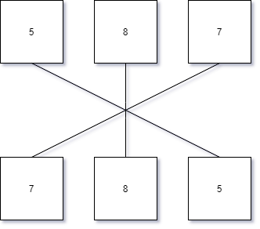
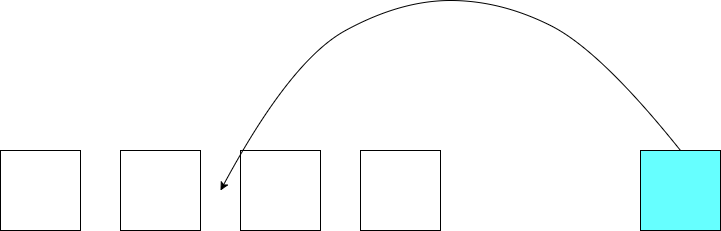
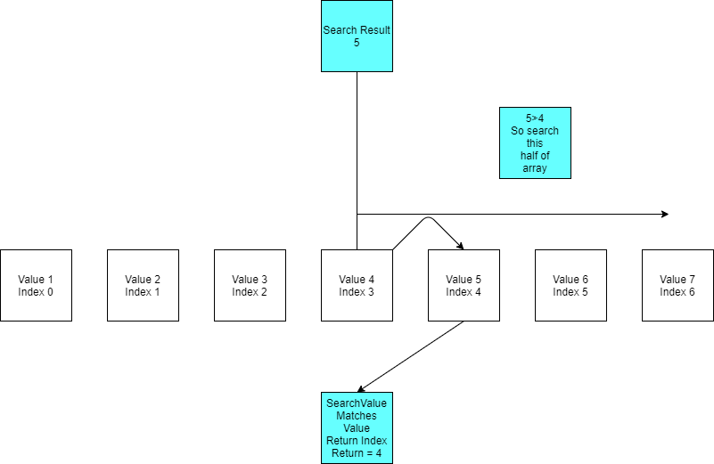

# Array Challenges
## Reverse
+ Should take in an array and return an array in reverse order without using built in methods.

## Shift
+ Should take in an array and a value to be added to the middle without using built in methods.

## Binary
+ Write a function called BinarySearch which takes in 2 parameters: a sorted array and the search key. Without utilizing any of the built-in methods available to your language, return the index of the array’s element that is equal to the search key, or -1 if the element does not exist.
+ NOTE: The search algorithm used in your function should be a binary search.
