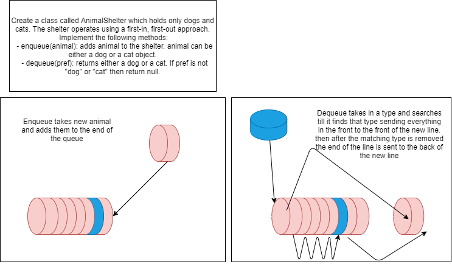

# First In First Out Animal Shelter

## Feature Tasks
+ Create a class called AnimalShelter which holds only dogs and cats. The shelter operates using a first-in, first-out approach.
+ Implement the following methods:
  + ```enqueue(animal)```: adds animal to the shelter. animal can be either a dog or a cat object.
  + ```dequeue(pref)```: returns either a dog or a cat. If pref is not "dog" or "cat" then return null.
## Stretch Goal
If a cat or dog isn’t preferred, return whichever animal has been waiting in the shelter the longest.

## Requirements
Ensure your complete solution follows the standard requirements.

+ Write unit tests
+ Follow the template for a well-formatted README

