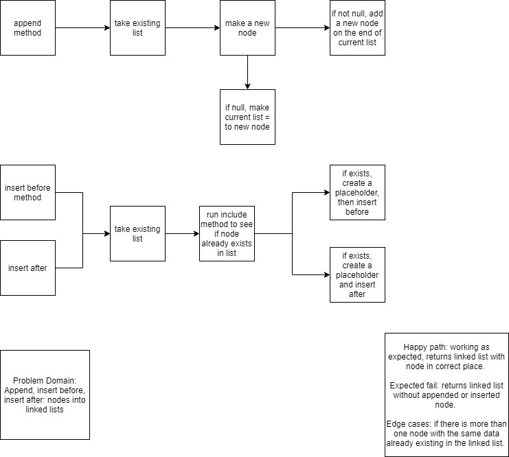

# Singly Linked List

## Challenge
+ Create a Node class that has properties for the value stored in the Node, and a pointer to the next Node.
+ Within your LinkedList class, include a head property. Upon instantiation, an empty Linked List should be created.
  + Define a method called insert which takes any value as an argument and adds a new node with that value to the head of the list with an O(1) Time performance.
  + Define a method called includes which takes any value as an argument and returns a boolean result depending on whether that value exists as a Node’s value somewhere within the list.
  + Define a method called toString (or __str__ in Python) which takes in no arguments and returns a string representing all the values in the Linked List, formatted as:
    + "{ a } -> { b } -> { c } -> NULL"
+ Any exceptions or errors that come from your code should be semantic, capturable errors. For example, rather than a default error thrown by your language, your code should raise/throw a custom, semantic error that describes what went wrong in calling the methods you wrote for this lab.
+ Be sure to follow your language/frameworks standard naming conventions (e.g. C# uses PascalCasing for all method and class names).
## Approach & Efficiency
+ Used demo code to pass tests.

## Challenge
### Feature Tasks
+ Write the following methods for the Linked List class:

  + .append(value) which adds a new node with the given value to the end of the list
  + .insertBefore(value, newVal) which add a new node with the given newValue immediately before the first value node
  + .insertAfter(value, newVal) which add a new node with the given newValue immediately after the first value node
### Examples
.append(value)

Input	                         | Args |	Output
-------------------------------|------|-------------------------------------
head -> [1] -> [3] -> [2] -> X |	5	  | head -> [1] -> [3] -> [2] -> [5] -> X
head -> X	                     |  1	  | head -> [1] -> X

.insertBefore(value, newVal)

Input	                         | Args	 | Output
-------------------------------|-------|----------------------------------
head -> [1] -> [3] -> [2] -> X |	3, 5 |	head -> [1] -> [5] -> [3] -> [2] -> X
head -> [1] -> [3] -> [2] -> X |	1, 5 |	head -> [5] -> [1] -> [3] -> [2] -> X
head -> [1] -> [2] -> [2] -> X |	2, 5 |	head -> [1] -> [5] -> [2] -> [2] -> X
head -> [1] -> [3] -> [2] -> X |	4, 5 |	Exception

.insertAfter(value, newVal)

Input                          |	Args |	Output
-------------------------------|-------|-------------------------------------
head -> [1] -> [3] -> [2] -> X |	3, 5 |	head -> [1] -> [3] -> [5] -> [2] -> X
head -> [1] -> [3] -> [2] -> X |	2, 5 |	head -> [1] -> [3] -> [2] -> [5] -> X
head -> [1] -> [2] -> [2] -> X |	2, 5 |	head -> [1] -> [2] -> [5] -> [2] -> X
head -> [1] -> [3] -> [2] -> X |  4, 5 |	Exception

